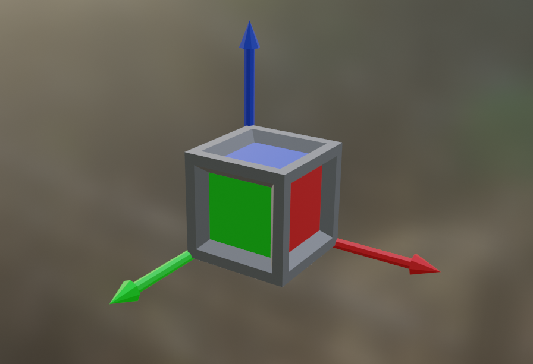
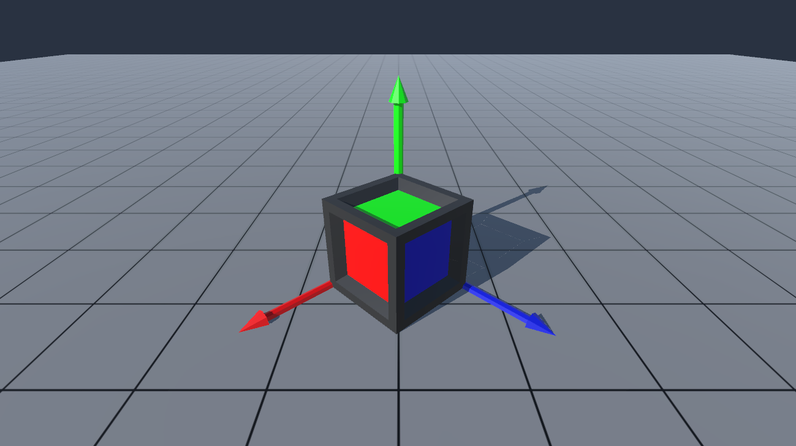

# Coordie The Co-ordinate Cube

A bare-bones Blender file containing a coordinate frame cube with an X, Y and Z axis, for whenever you might need that kind of thing. Also contains a Unity project with some basic scripting.

## Blender file
The blender file is just an object with a sphere representing the point of the coordinate frame, a cube, and three axis arrows pointing in their respecitive directions. Colours are used to indicate direction.

The blender file is within the Unity project.

## Unity project
A very basic Unity project that contains the cube and a grid plane. A script is applied to the coordinate cube to stop the point sphere and axis arrows from warping when things are resized (works in play mode only).

## What do I do with this?
Whatever you want! I made this for fun and also because I thought it might be helpful when teaching my students about coordinates frames, vectors and points. Use it in your teaching, your projects, and more! Please let me know if it helped you.

## License: CC BY-SA 4.0
This project is released under the Attribution-ShareAlike 4.0 International (CC BY-SA 4.0) license. A summary of that license is below, but the full license can be read [here](https://creativecommons.org/licenses/by-sa/4.0/legalcode).

### You are free to:
Share — copy and redistribute the material in any medium or format.
Adapt — remix, transform, and build upon the material for any purpose, even commercially.

The licensor cannot revoke these freedoms as long as you follow the license terms.

### Under the following terms:
Attribution — You must give appropriate credit, provide a link to the license, and indicate if changes were made. You may do so in any reasonable manner, but not in any way that suggests the licensor endorses you or your use.

ShareAlike — If you remix, transform, or build upon the material, you must distribute your contributions under the same license as the original.

No additional restrictions — You may not apply legal terms or technological measures that legally restrict others from doing anything the license permits.

### Notices:
You do not have to comply with the license for elements of the material in the public domain or where your use is permitted by an applicable [exception or limitation](https://creativecommons.org/licenses/by-sa/4.0/#:~:text=exception%20or%20limitation).

No warranties are given. The license may not give you all of the permissions necessary for your intended use. For example, other rights such as [publicity, privacy, or moral rights](https://creativecommons.org/licenses/by-sa/4.0/#) may limit how you use the material.

 
